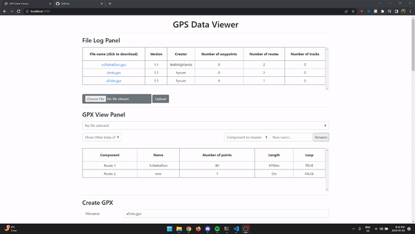

# GPX Data Parser

## Usage
Run the following commands to start the webserver
```sh
$ npm install
$ npm run dev PORT
```

Navigate to http://localhost:PORT to begin using the interface

## Example

